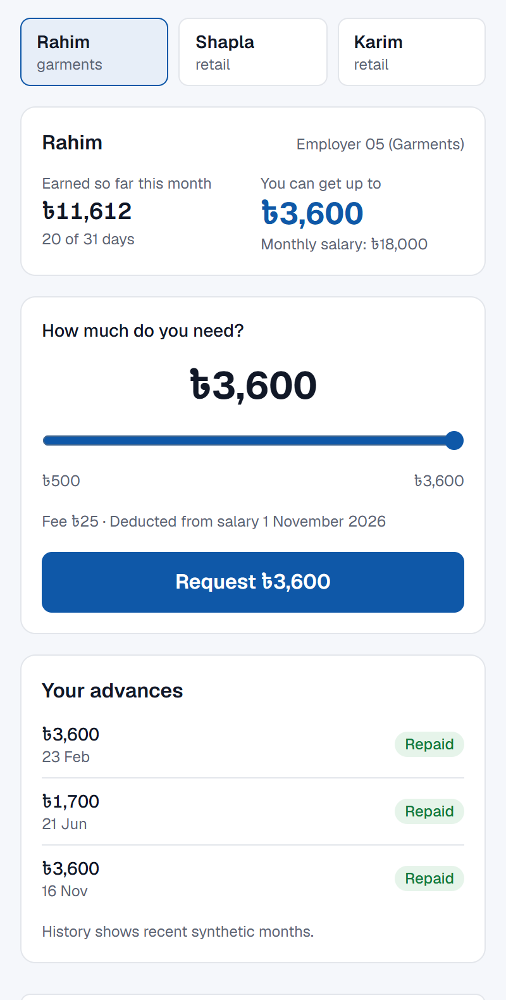
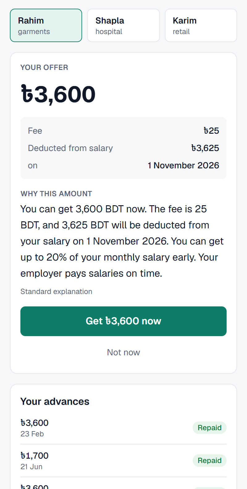
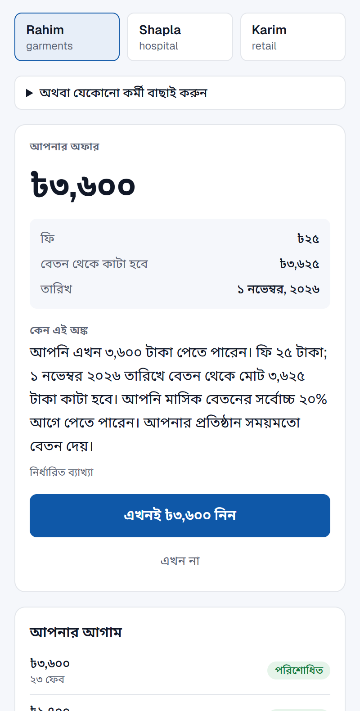
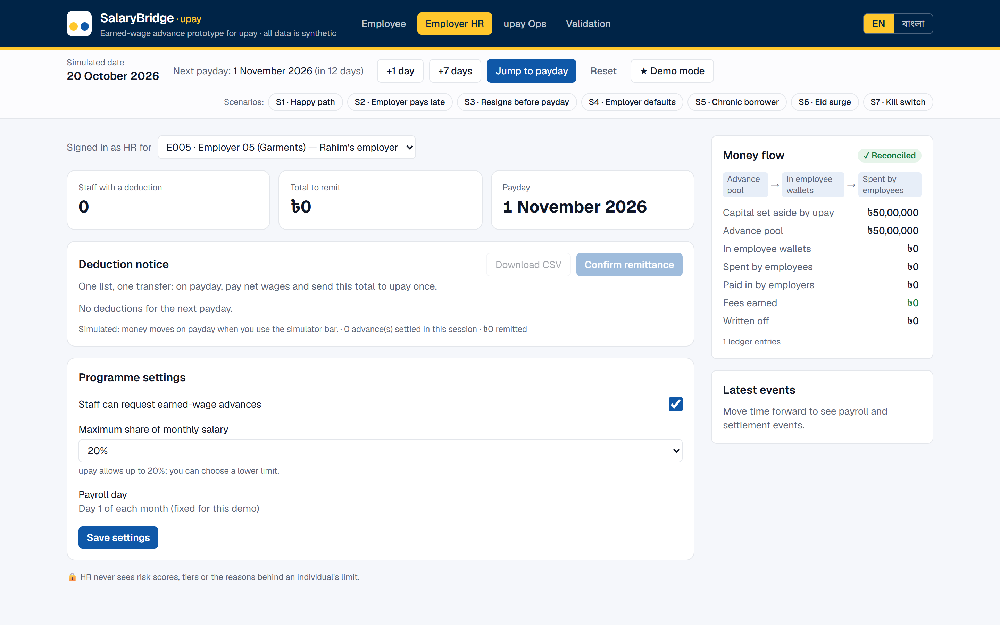
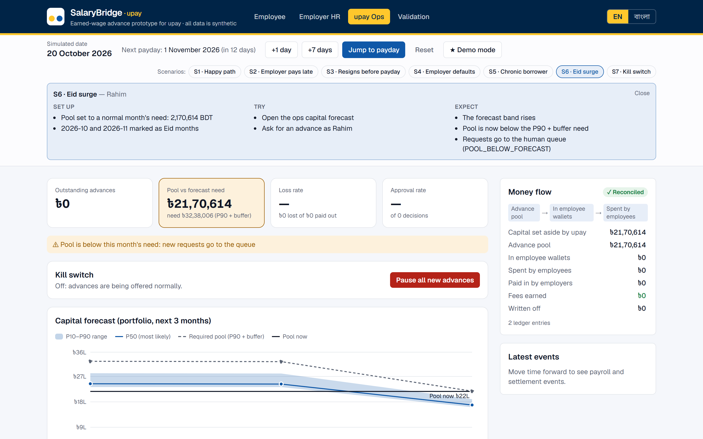

# SalaryBridge

**Earned wages in the upay wallet before payday.** A worker asks for part of the salary they have already earned;
AI sizes the advance and explains it in English or Bangla; on payday the employer sends upay one bulk transfer from a
ready-made deduction list. Built for the DIU CPC × upay AI Hackathon 2026. **All data is synthetic.**

**Live demo: [salary-bridge-iota.vercel.app](https://salary-bridge-iota.vercel.app)** · API:
[salarybridge-api.onrender.com/health](https://salarybridge-api.onrender.com/health). The API runs on Render's free
plan and sleeps after 15 idle minutes, so the first request can take about a minute; press **★ Demo mode** to start.

| Employee (phone) | Offer with reason | বাংলা |
|---|---|---|
|  |  |  |

| Employer HR: one deduction list | upay ops: Eid surge pushes need above the pool |
|---|---|
|  |  |

## How it works

- **Rules decide, AI sizes.** Hard cap = min(20% of salary, earned − already owed); tenure, monthly count and
  cooling-off rules are the only things that decline. Models can only shrink an offer or send it to a person.
- **Five models**, all point-in-time with leakage tests: M1 employer late-payroll risk, M2 repayment risk → tier
  A/B/C/D, M3 leaving before payday, M4 capital forecast (P10–P90, pool = P90 + 15%), M5 borrowing-pattern monitor.
- **Claude** rewrites the decision in plain English/Bangla from an allow-listed fact sheet; numbers are checked and a
  template is used when no API key is set.
- **Double-entry ledger** in integer paisa, settlement waterfall (employer remittance → wallet debit → carry-over →
  write-off), seven demo scenarios (S1–S7) and a kill switch.

## Results (generated by `scripts/validate.py`, test months never used for training)

| | Flat 20% cap (no AI) | SalaryBridge ML tiers |
|---|---|---|
| Loss rate, Profile A (training world) | 0.95% | **0.59%** |
| Loss rate, Profile B (harsher stress world) | 1.55% | **1.19%** |

8 of 10 targets declared up front pass; the 2 misses are shown with analyst notes in
[`docs/validation_report.md`](docs/validation_report.md). Phase 2: employer headcount was removed from M1–M3, cutting the worst
employer-size approval gap from 9.13 pp to 5.25 pp (Profile B now passes; the Profile A gap runs against large employers and is
explained in the report). Economics at the ৳25 fee: −৳10,876 per sandbox month;
break-even fee ৳49 (A) / ৳60 (B). Responsible-AI controls and the test guarding each one:
[`docs/responsible_ai.md`](docs/responsible_ai.md).

Demo script: [`docs/demo_script.md`](docs/demo_script.md) · deploy: [`docs/deploy.md`](docs/deploy.md).

Design documents: `plan.md` (how it works), `plot.md` (what users see).

Track: **03 · Customer Innovation & Financial Independence** (responsible credit readiness), with capital
forecasting from the Merchant & Agent Intelligence track.

## Features

- **Employee (mobile-first):** earned-to-date and safe limit, one slider, offer with fee, total deduction and date,
  plain-language reason, full Bangla (বাংলা) mode, advance history.
- **Employer HR:** deduction notice and CSV for payday, one-click remittance confirmation, programme settings (limit,
  on/off).
- **upay Ops:** KPIs, capital forecast with P10–P90 band, human approval queue, kill switch, employer risk table with
  reasons, borrowing-pattern monitor.
- **Validation:** pre-declared targets with pass/fail, loss vs approval, calibration, fairness gaps, economics sliders.
- **Simulator:** move time (+1 day, +7 days, jump to payday), Demo mode and seven scenarios (S1 happy path … S7 kill
  switch); every user gets an isolated sandbox session.

Where AI is used: M1–M5 (LightGBM, quantile LightGBM + conformal, IsolationForest, SHAP reasons) size, queue or
monitor; Claude only rewrites the decision's facts into plain language. Details in [How it works](#how-it-works).

## Technology stack

| Layer | Used |
|---|---|
| Backend | Python 3.11, FastAPI, Pydantic, SQLAlchemy 2 (Core), SQLite, Uvicorn |
| Data and ML | pandas, NumPy, SciPy, scikit-learn, LightGBM, SHAP, joblib |
| Generative AI | Anthropic Claude API (`claude-opus-5-5`), optional, with deterministic templates as fallback |
| Frontend | Next.js 16 (App Router, React 19, TypeScript), Tailwind CSS v4, Recharts |
| Testing | pytest (229 tests), ESLint, TypeScript |
| Hosting | Render (API, `render.yaml`), Vercel (frontend) |

## Requirements

- Python **3.11** (the models were pickled with the exact versions in `backend/requirements.txt`)
- Node.js **20.9 or newer** and npm
- About 1 GB of disk for dependencies and 400 MB of RAM for the API; no GPU
- Optional: an Anthropic API key for LLM-worded explanations

## Environment variables

Defaults work for local use; nothing has to be set. Never commit real keys.

| Where | Variable | Purpose | Default / example |
|---|---|---|---|
| Backend | `CORS_ORIGINS` | Comma-separated frontend origins allowed to call the API | `http://localhost:3000` |
| Backend | `SEED` | Seed for the synthetic world | `42` |
| Backend | `ANTHROPIC_API_KEY` | Enables LLM wording; empty = template explanations | `<your-key>` (optional) |
| Backend | `LLM_MODEL`, `LLM_TIMEOUT_S` | Claude model and timeout before falling back | `claude-opus-5-5`, `20` |
| Backend | `DATABASE_URL` | Seed database location | `sqlite:///<backend>/seed.db` |
| Backend | `SIM_DIR`, `SESSION_TTL_HOURS` | Where sandbox sessions live and when idle ones are removed | system temp, `6` |
| Backend | `POLICY__<NAME>` | Override any policy number in `docs/assumptions.md` | `POLICY__FEE_FLAT_BDT=49` |
| Frontend | `NEXT_PUBLIC_API_BASE_URL` | API base URL, no trailing slash (build-time) | `http://localhost:8000` |

Templates: `backend/.env.example` → `backend/.env`, `frontend/.env.example` → `frontend/.env.local`. Production values:
[`docs/deploy.md`](docs/deploy.md#environment-variables).

## Backend (FastAPI, Python 3.11)

```bash
cd backend
uv venv --python 3.11 .venv
uv pip install --python .venv/Scripts/python.exe -r requirements-dev.txt
.venv/Scripts/python.exe -m pytest
.venv/Scripts/python.exe -m uvicorn app.main:app --reload --port 8000
```

Without `uv`: `py -3.11 -m venv .venv` then `.venv/Scripts/python.exe -m pip install -r requirements-dev.txt`.

Test groups (all run by plain `pytest`):

- quick loop, about 20 s: `.venv/Scripts/python.exe -m pytest -m "not slow and not integration"`
- `integration`: API tests on the full-size simulated world (marked automatically)
- `slow`: end-to-end model training and full validation runs

Responsible-AI and security controls, with the test guarding each one: `docs/responsible_ai.md`.
Validation report (generated, never hand-edited): `.venv/Scripts/python.exe -m scripts.validate` → `docs/validation_report.md`.

Models are trained offline and the artifacts in `backend/artifacts/` are committed. Retrain in order (M2 uses M1):

```bash
.venv/Scripts/python.exe -m app.ml.m1_employer
.venv/Scripts/python.exe -m app.ml.m2_repayment
.venv/Scripts/python.exe -m app.ml.m3_attrition
.venv/Scripts/python.exe -m app.ml.m4_capital
.venv/Scripts/python.exe -m app.ml.m5_abuse
```

On first start the API builds `backend/seed.db` from the fixed seed (about 2 seconds). To rebuild it by hand: `.venv/Scripts/python.exe -m data.seed`. Delete `seed.db` to force a rebuild; the same seed always gives the same data.

On macOS/Linux use `.venv/bin/python` instead of `.venv/Scripts/python.exe`. Copy `.env.example` to `.env` to override settings.

## Frontend (Next.js)

```bash
cd frontend
npm install
npm run dev
```

Open http://localhost:3000. The page shows the API health. Set `NEXT_PUBLIC_API_BASE_URL` (see `frontend/.env.example`) when the API is not on `http://localhost:8000`.

Production build and checks:

```bash
npm run build
npm start
npm run lint
```

## Verify the features by hand

1. Press **★ Demo mode**: Rahim can get up to ৳3,600 of ৳11,612 earned. Request it, read the reason, accept.
2. **Employer HR**: Rahim's ৳3,625 is on the deduction notice. Press **Jump to payday**; the ledger stays
   **✓ Reconciled**.
3. **upay Ops**: run **S6 · Eid surge**; the forecast need rises above the pool and new requests go to the queue.
4. **S5 · Chronic borrower** shows a supportive cooling-off; **S7 · Kill switch** blocks new requests.
5. **Validation**: targets, charts and the economics sliders, all read from generated files.

## Deploy

Backend on Render (`render.yaml`), frontend on Vercel. Step-by-step guide, every environment variable, demo-day
checklist and troubleshooting:
[`docs/deploy.md`](docs/deploy.md). Free Render services sleep after 15 minutes idle; open `/health` about 10 minutes
before a demo.
